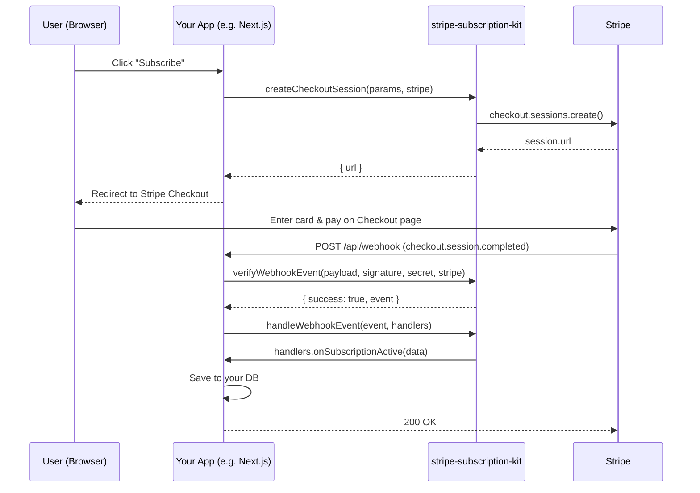
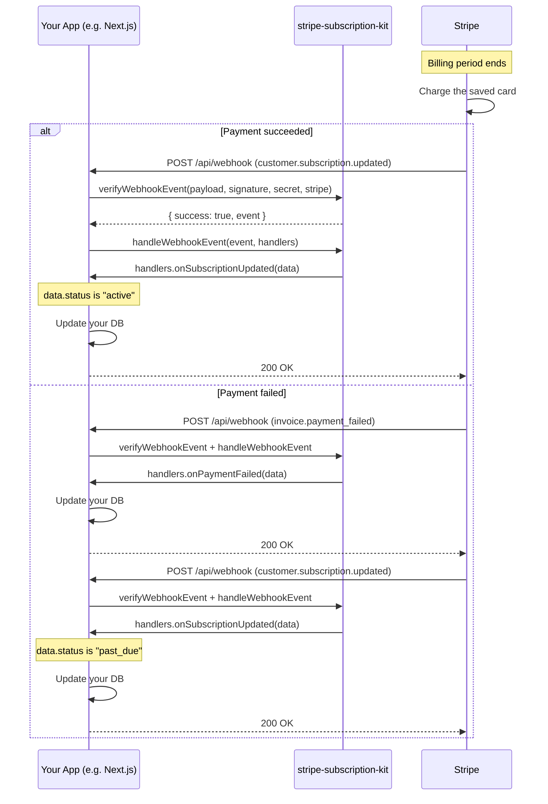

# stripe-subscription-kit

[English version: README.md](./README.md)

Checkout・webhook検証・Billing Portalをまとめた、フレームワーク非依存のStripeサブスクリプションツールキットです。

## インストール

```bash
npm install stripe-subscription-kit
```

## 特徴

- **フレームワーク非依存** — Next.jsだけでなく、Express など他のNode.jsフレームワークでも動作します。
- **webhook検証はResult型を返すシンプルな関数** — `verifyWebhookEvent` は例外をthrowする代わりに `{ success, ... }` の結果オブジェクトを返すため、try/catchなしで不正な署名を扱えます。
- **イベント振り分けを肩代わり** — `handleWebhookEvent` がStripeイベントの種別を見て対応するコールバックを呼び出すため、呼び出し側は `switch` 文を書かずに `WebhookHandlers` を実装するだけで済みます。
- **プラン変更・キャンセルはStripe Customer Portalに委譲** — 自前の課金管理UIを作る必要はなく、`createPortalSession` でStripeがホストするセルフサービス画面に顧客を送るだけです。

## 仕組み

サブスクリプションには、次の2つの場面があります。

- **申し込み（初回）** — ユーザーがCheckoutページでカードを入力して支払い、契約が始まる場面です。ユーザーの操作から始まります。
- **自動更新（2回目以降）** — 請求期間が終わるたびに、Stripeが保存済みのカードに自動で請求する場面です。ユーザーの操作もアプリからの呼び出しもなく、Stripe側から始まります。アプリが請求の結果を知る手段は、webhookだけです。

### 申し込み（初回）の流れ



### 自動更新（2回目以降）の流れ



請求に成功すると、請求期間が更新されたことが `customer.subscription.updated` で通知され、`onSubscriptionUpdated` が呼ばれます。請求に失敗すると、`invoice.payment_failed` で `onPaymentFailed` が呼ばれます。あわせて、契約の状態が `past_due` に変わったことが `customer.subscription.updated` で通知され、`onSubscriptionUpdated` も呼ばれます。この2つのイベントが届く順番は保証されないため、どちらが先に届いても正しく動くように処理してください。どちらの場合も、kitはStripeからの通知を検証して振り分けるだけで、請求そのものはStripeが行います。

### kitの役割

- **独立したサーバーではなくライブラリ** — kitは、アプリの中から呼び出される関数の集まりです。別プロセスとして動いたり、独自のエンドポイントを持ったりはしません。
- **webhookを受け取るのはアプリ** — Stripeはアプリのエンドポイントにwebhookを送ります。kitは、アプリのリクエスト処理の中で、署名の検証と、イベントを扱いやすいデータに整理する役割だけを担います。
- **Stripe APIの呼び出しは、アプリから渡されたStripeインスタンス経由** — `createCheckoutSession` と `createPortalSession` は、アプリが渡した `stripe` インスタンスを通してStripe APIを呼び出します。kitからStripeへの通信は、これだけです。
- **コールバックはアプリが書き、kitが呼び返す** — アプリは `WebhookHandlers` を `handleWebhookEvent` に渡し、kitはイベントに対応するものを呼び出します。`checkout.session.completed` などのイベント名はStripeが定めたもので、`onSubscriptionActive` などのコールバック名はkitが付けた名前です。

## クイックスタート

### 1. Checkout Sessionの作成

```ts
import Stripe from "stripe";
import { createCheckoutSession } from "stripe-subscription-kit";

const stripe = new Stripe(process.env.STRIPE_SECRET_KEY!);

const { url } = await createCheckoutSession(
  {
    priceId: "price_123",
    successUrl: "https://example.com/success",
    cancelUrl: "https://example.com/cancel",
    customerId: "cus_123", // 省略可
    metadata: { orderId: "order_456" }, // 省略可
  },
  stripe
);

// url に顧客をリダイレクトしてCheckoutを完了させます。
```

### 2. webhookの処理(Next.js App RouterのRoute Handlerを想定)

```ts
// app/api/webhooks/stripe/route.ts
import Stripe from "stripe";
import { verifyWebhookEvent, handleWebhookEvent } from "stripe-subscription-kit";

const stripe = new Stripe(process.env.STRIPE_SECRET_KEY!);

export async function POST(request: Request) {
  const payload = await request.text();
  const signature = request.headers.get("stripe-signature") ?? "";

  const verified = verifyWebhookEvent(
    payload,
    signature,
    process.env.STRIPE_WEBHOOK_SECRET!,
    stripe
  );

  if (!verified.success) {
    return new Response(verified.error, { status: 400 });
  }

  await handleWebhookEvent(verified.event, {
    onSubscriptionActive: async (data) => {
      // data.customerId, data.subscriptionId, data.priceId, data.metadata
    },
    onSubscriptionUpdated: async (data) => {
      // data.customerId, data.subscriptionId, data.priceId, data.metadata
    },
    onSubscriptionCanceled: async (data) => {
      // data.customerId, data.subscriptionId
    },
    onPaymentFailed: async (data) => {
      // data.customerId, data.subscriptionId, data.invoiceId
    },
  });

  return new Response(null, { status: 200 });
}
```

### 3. Portal Sessionの作成

```ts
import Stripe from "stripe";
import { createPortalSession } from "stripe-subscription-kit";

const stripe = new Stripe(process.env.STRIPE_SECRET_KEY!);

const { url } = await createPortalSession(
  {
    customerId: "cus_123",
    returnUrl: "https://example.com/account",
  },
  stripe
);

// url に顧客をリダイレクトしてサブスクリプションを管理させます。
```

## APIリファレンス

### `createCheckoutSession(params, stripe)`

サブスクリプション(または単発決済)用のStripe Checkout Sessionを作成します。

**パラメータ** (`CreateCheckoutSessionParams`):

| フィールド | 型 | 必須 | 説明 |
| --- | --- | --- | --- |
| `priceId` | `string` | 必須 | チェックアウト対象のStripe Price ID。`metadata.priceId` にも自動でコピーされます。 |
| `successUrl` | `string` | 必須 | チェックアウト成功後のリダイレクト先URL。 |
| `cancelUrl` | `string` | 必須 | 顧客がキャンセルした場合のリダイレクト先URL。 |
| `customerId` | `string` | 省略可 | セッションに紐づける既存のStripe Customer ID。 |
| `metadata` | `Record<string, string>` | 省略可 | セッションに追加するメタデータ(`priceId` は常に含まれます)。 |
| `mode` | `"subscription" \| "payment"` | 省略可 | 省略時は `"subscription"`。 |

**戻り値** (`CreateCheckoutSessionResult`): `{ url: string }` — 顧客をリダイレクトさせるCheckout SessionのURL。

Stripeがセッションのurlを返さなかった場合はエラーをthrowします。

### `createPortalSession(params, stripe)`

顧客がサブスクリプションを管理できるStripe Billing Portal Sessionを作成します。

**パラメータ** (`CreatePortalSessionParams`):

| フィールド | 型 | 必須 | 説明 |
| --- | --- | --- | --- |
| `customerId` | `string` | 必須 | Stripe Customer ID。 |
| `returnUrl` | `string` | 必須 | 顧客がポータルから戻ってきたときのリダイレクト先URL。 |

**戻り値** (`CreatePortalSessionResult`): `{ url: string }` — Billing Portal SessionのURL。

### `verifyWebhookEvent(payload, signature, secret, stripe)`

Stripe webhookの署名を検証し、イベントをパースします。

**パラメータ**:

| パラメータ | 型 | 説明 |
| --- | --- | --- |
| `payload` | `string` | リクエストボディの生の文字列(パース前のもの)。 |
| `signature` | `string` | `Stripe-Signature` ヘッダーの値。 |
| `secret` | `string` | webhook署名用のシークレット(`whsec_...`)。 |
| `stripe` | `Stripe` | Stripe SDKのインスタンス。 |

**戻り値** (`VerifyWebhookEventResult`):

- 署名が正しい場合: `{ success: true, event: Stripe.Event }`
- 検証に失敗した場合(secretの不一致、署名フォーマットの不正など): `{ success: false, error: string }`

### `handleWebhookEvent(event, handlers)`

検証済みのStripeイベントを、`handlers` の対応するコールバックに振り分けます。

**パラメータ**:

| パラメータ | 型 | 説明 |
| --- | --- | --- |
| `event` | `Stripe.Event` | 検証済みのイベント(通常は `verifyWebhookEvent` の戻り値の `event`)。 |
| `handlers` | `WebhookHandlers` | サブスクリプションのライフサイクルイベントごとのコールバック(下表参照)。 |

`WebhookHandlers`:

| コールバック | 呼ばれるイベント | 渡されるデータ |
| --- | --- | --- |
| `onSubscriptionActive` | `checkout.session.completed` | `SubscriptionActiveData`: `{ customerId, subscriptionId, priceId, metadata? }` |
| `onSubscriptionUpdated` | `customer.subscription.updated` | `SubscriptionUpdatedData`: `{ customerId, subscriptionId, priceId, metadata? }` |
| `onSubscriptionCanceled` | `customer.subscription.deleted` | `SubscriptionCanceledData`: `{ customerId, subscriptionId }` |
| `onPaymentFailed` | `invoice.payment_failed` | `PaymentFailedData`: `{ customerId, subscriptionId, invoiceId }`(invoiceに紐づくsubscriptionがない場合、`subscriptionId` は `""`) |

**戻り値** (`HandleWebhookEventResult`): `{ handled: boolean; type: string }` — 上表にないイベント種別では `handled` が `false` になり、どのコールバックも呼ばれません。

## 設計思想

`verifyWebhookEvent` と `handleWebhookEvent` は意図的に方式を分けています。署名検証は「この署名は正しいか」という単発の判定なので、`{ success, ... }` を返すシンプルな関数が適しています。例外をキャッチする必要もなく、単一の結果に対してコールバックを用意する必要もありません。一方、イベントの振り分けは複数のイベント種別にまたがり、それぞれデータ形が異なる分岐処理です。そのため `WebhookHandlers` によるコールバック方式の方が適しています。各イベント種別を独立してテストしやすく、呼び出し側も自分が必要なコールバックだけを実装すれば済みます。

## ライセンス

MIT
